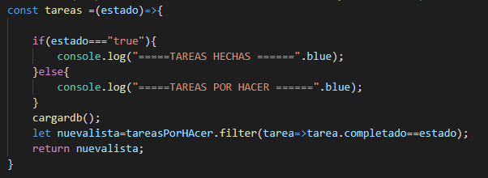
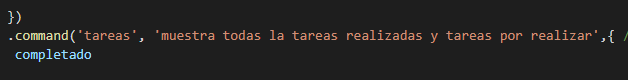
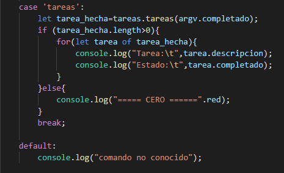
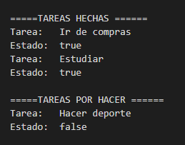
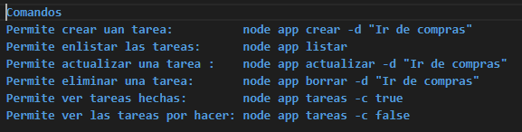

             <h1>UNIVERSIDAD POLITECNICA SALESIANA</h1>
                     <h2> CARRERA COMPUTACIÓN </h2>
                        <h3>PLATAFORMAS WEB</h3>

 NOMBRE: SEBASTIAN GUANDINANGO

 <h2> informe de tareas por hacer </h2>

# 1 Implementacion de las funciones que nos permita ver ya sea las tareas realizadas y las tareas aun por hacer para esto se creo dos metodo dentro la clase tareas-por-hacer.js el cual nos quedo de la siguiente manera:
 
# Una ves realizada los metodos dentro de la clase yargs.js se aumento los parametros para los comandos como se puede observar:
 
# Y para finalizar dentro de la clase app.js se hizo el llamdo alos metodos para poder ejecutalos el cual nos queda de la siguiente manera.
 
# Resultado
 

# Detalle de la aplicacion

Dentro de esta aplicacion se han realizado la implmentacion de la funcion que nos permita realizar una busqueda de la tareas realizada y las tareas por hacer para lo cual se debe ejecutar de la siguinte manera:
 

# Estas dos ultimas consulatas si no se le asigna un valor  por defecto enlista las tareas ya realizadas 